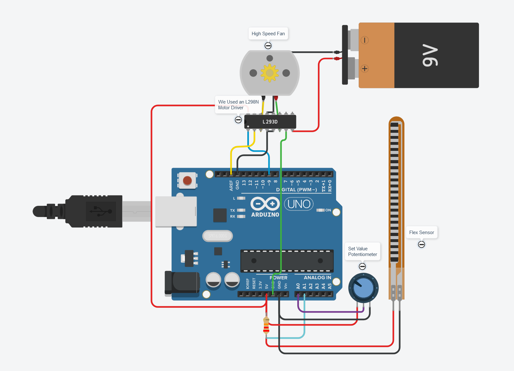
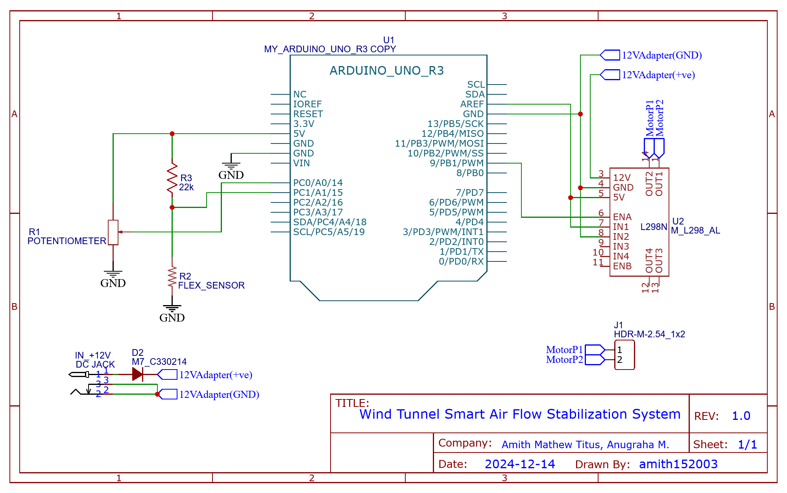

# Wind Tunnel Smart Air Flow Stabilization System

## Overview
The **Wind Tunnel Smart Air Flow Stabilization System** is designed to ensure precise and stable airflow conditions within a wind tunnel by dynamically adjusting fan speed based on real-time feedback. This system employs a **flex sensor** to measure the angular displacement of a flap, which reflects airflow stability, and uses a **PID control algorithm** to maintain a consistent flap angle under varying conditions.

---

## Objectives
- Design a smart airflow system using sensor feedback to stabilize airflow.
- Use a **flex sensor** to measure the angular displacement of a flap.
- Implement real-time **feedback control** to dynamically adjust fan speed and compensate for external disturbances.
- Achieve precise control of airflow conditions by stabilizing the flap angle to a desired set point.
- Test the system under simulated disturbances and verify performance.

---

## Features
- **Real-Time Control**: Dynamic fan speed adjustments based on real-time sensor feedback.
- **PID Control**: Implementation of a PID algorithm to minimize error and stabilize the flap angle.
- **Disturbance Compensation**: Rapid response to external disturbances such as wind gusts.
- **Adjustable Set Point**: Ability to set and change the target flap angle for airflow stability.
- **Comprehensive Testing**: Ensures system reliability and stability under various conditions.

---

## System Components

### Hardware
| Component           | Description                                   |
|---------------------|-----------------------------------------------|
| **Microcontroller** | ATMEGA328                                    |
| **Sensor**          | Flex Sensor                                  |
| **Actuator**        | Fan                                          |
| **Motor Driver**    | L298N                                        |
| **Angle Control**   | Potentiometer                                |
| **Power Supply**    | Stable power for MCU and fan                 |

### Software
- **Development Environment**: PlatformIO
- **Programming Language**: C
- **Control Algorithm**: PID (Proportional-Integral-Derivative)

---

## System Architecture
1. **Flex Sensor Integration**:
   - Configured in a voltage divider setup to measure angular displacement of the flap.
   - Sensor data converted to voltage and processed using ADC.

2. **Fan Control Circuit**:
   - Fan connected to a PWM-capable pin for speed control.
   - Motor driver (L298N) ensures safe operation.

3. **PID Control**:
   - PID algorithm minimizes the error between desired and actual flap angle.
   - Adjusts fan speed dynamically using PWM signals.

4. **Power Management**:
   - Stable power supply ensures consistent system performance.

---

## Schematics and Hardware Setup

### **Schematic 1: System Simulation**
This schematic shows the simulation setup of the flex sensor, fan, motor driver, and microcontroller.



---

### **Schematic 2: Final Schematic**
This is the final Schematic diagram.



---

### **Hardware Setup 1: Testing Circuit without a load**

.jpg)

---

### **Hardware Setup 2: Testing Circuit with a load**


---

## Control Algorithm
The **PID Control Algorithm** operates as follows:
1. Continuously read the flex sensor output (flap angle).
2. Calculate the error: `Error = Desired Angle - Actual Angle`.
3. Apply the PID formula:
   ```
   PWM = Kp * Error + Ki * Integral(Error) + Kd * Derivative(Error)
   ```
4. Adjust fan speed using the PWM signal.

---

## Testing and Calibration
### Test Scenarios
1. **Initial Stability**:
   - Verify that the flap stays at the set angle under stable airflow conditions.

2. **External Disturbance**:
   - Introduce disturbances (e.g., sudden wind gusts) and observe system compensation.

3. **Set Point Adjustment**:
   - Test the ability to change the desired flap angle dynamically.

4. **Long-term Stability**:
   - Run the system for extended periods to ensure reliability.

### Calibration
- Tune the PID constants (**Kp**, **Ki**, **Kd**) for smooth and stable adjustments.
- Evaluate performance by plotting the flap angle over time.

---

## Results
The system successfully stabilizes airflow within the wind tunnel, ensuring the flap angle remains consistent even under external disturbances. The PID control loop allows for real-time compensation and smooth adjustments, achieving precise airflow conditions.

---

## Team Members
- **Amith Mathew Titus**  
- **Anugraha M.**

---

## Future Improvements
- Integration of additional sensors for enhanced airflow monitoring.
- Implementation of machine learning for adaptive PID tuning.
- Remote control and monitoring via IoT integration.

---

## Getting Started
### Requirements
- **PlatformIO**
- Basic electronics components as listed above

### Instructions
1. Clone the repository:
   ```bash
   git clone https://github.com/your-repo-name.git
   ```
2. Install dependencies and upload the code to ATMEGA328.
3. Assemble the hardware components as per the schematic.
4. Power up the system and set the desired flap angle using the potentiometer.
5. Test the system using the scenarios outlined above.

---

## License
This project is licensed under the **MIT License**. See the [LICENSE](LICENSE) file for details.

---

## Contact
For any queries or contributions:
- **Amith Mathew Titus**: [Email](amithmathewtitus@outlook.com)
- **Anugraha M.**: [Email](anugrahamahesh28@gmail.com)

---

**Project Status**: Completed ✅
